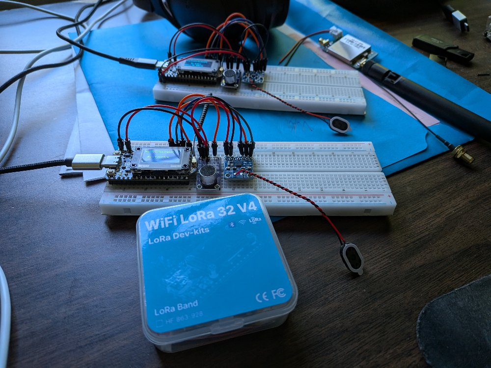

# open-oswst

Stealth LoRa radio mesh where the primary design principle is "only speak when spoken to".



## Hardware

- **Board**: [Heltec WiFi LoRa 32 V4](https://heltec.org/project/wifi-lora-32-v4/) (ESP32-S3 + SX1262, 863-928 MHz)
- **MCU**: ESP32-S3 rev 0.2, 16MB flash, 338 KiB RAM
- **Radio**: Semtech SX1262 LoRa transceiver, 915 MHz ISM band
- **Display**: SSD1306 128x64 OLED (I2C)

### Pin Map

| Function | GPIO |
|---|---|
| PRG button (PTT) | 0 (active LOW, internal pull-up) |
| White LED | 35 |
| Vext power enable | 36 (LOW = on) |
| OLED SDA | 17 |
| OLED SCL | 18 |
| OLED RST | 21 |
| LoRa SCK | 9 |
| LoRa MOSI | 10 |
| LoRa MISO | 11 |
| LoRa NSS | 8 |
| LoRa RST | 12 |
| LoRa DIO1 | 14 |
| LoRa BUSY | 13 |

## Dev Environment Setup

### Prerequisites

1. **Install Rust + Xtensa toolchain** via [espup](https://github.com/esp-rs/espup):

```bash
cargo install espup
espup install
```

2. **Create an ESP environment export script** (`~/export-esp.sh`):

```bash
export LIBCLANG_PATH="$HOME/.rustup/toolchains/esp/xtensa-esp32-elf-clang/esp-20.1.1_20250829/esp-clang/lib"
export PATH="$HOME/.rustup/toolchains/esp/xtensa-esp-elf/esp-15.2.0_20250920/xtensa-esp-elf/bin:$PATH"
```

The exact paths may vary — check `~/.rustup/toolchains/esp/` after `espup install`.

3. **Install flashing tools**:

```bash
cargo install espflash cargo-espflash ldproxy
```

4. **Optional**: install `picocom` for serial monitoring:

```bash
sudo apt install picocom
```

### Build

```bash
. ~/export-esp.sh
cargo build
```

ESP-IDF v5.5.x is downloaded automatically by `esp-idf-sys` on first build (takes a while).

### Flash

The firmware uses a custom partition table with a dedicated `loraudio` NVS partition for device config. Since `espflash flash` overwrites the partition table with its own, you must re-write ours after flashing:

```bash
. ~/export-esp.sh

# 1. Flash firmware
espflash flash -p /dev/ttyACM0 target/xtensa-esp32s3-espidf/debug/loraudio

# 2. Overwrite partition table with ours (espflash clobbers it in step 1)
espflash write-bin -p /dev/ttyACM0 0x8000 target/xtensa-esp32s3-espidf/debug/partition-table.bin

# 3. Write device config (only needed on first flash or to change config)
espflash write-bin -p /dev/ttyACM0 0xfad000 ~/phy/loraudio_nvs.bin
```

Monitor separately:

```bash
picocom /dev/ttyACM0 -b 115200
```

### Device Config (NVS)

Device configuration lives in a dedicated `loraudio` NVS partition at `0xfad000` (12KB), separate from the system NVS (PHY cal, WiFi, etc).

Generate a config image from `nvs_loraudio.csv`:

```bash
# Generate NVS image (edit nvs_loraudio.csv to change values)
python3 .embuild/espressif/python_env/idf5.5_py3.13_env/lib/python3.13/site-packages/esp_idf_nvs_partition_gen/nvs_partition_gen.py \
    generate nvs_loraudio.csv ~/phy/loraudio_nvs.bin 0x3000

# Flash to board
espflash write-bin -p /dev/ttyACM0 0xfad000 ~/phy/loraudio_nvs.bin
```

Current config keys (namespace `config`):

| Key | Type | Values | Default |
|-----|------|--------|---------|
| `repeater` | u8 | 0=endpoint, 1=repeater | 0 |

There is also `nvs_config.py` for read-modify-write of the *system* NVS partition (preserving PHY cal data etc), but the dedicated partition approach above is preferred.

## Current Behavior

- Simplex push-to-talk voice radio over LoRa
- Hold **PRG button** (GPIO 0) to talk — audio is captured, Codec2-encoded at 1200 bps, and streamed as 4-frame LoRa packets (160ms audio each)
- Release to listen — received audio is decoded and played through I2S speaker (MAX98357A)
- OLED shows mode (RX Listening / TX Streaming / RX Audio) with RSSI and SNR on receive
- CSMA with preamble-aware jitter for collision avoidance
- Per-device config via dedicated NVS partition (repeater mode flag)
- **Next up**: repeater mesh relay

## Key Implementation Notes

- **Framework**: esp-idf-svc 0.52.1 (std Rust, not bare-metal)
- **Async**: `block_on` + `embassy_futures::select` for zero-polling PTT/RX racing
- **LoRa driver**: `lora-phy` (upstream git, 3.0.2-alpha) with `GenericSx126xInterfaceVariant`
- **GPIO type erasure**: `degrade_input()`/`degrade_output()` required for lora-phy's generic interface
- **SPI async**: `CONFIG_SPI_MASTER_ISR_IN_IRAM` disabled in `sdkconfig.defaults`
- **defmt workaround**: `defmt-discard.x` linker script discards defmt sections that break ESP-IDF flash layout
- **Stack**: 65536 bytes for main task (Codec2 init needs large stack temporaries)

## Project Structure

```
src/main.rs          # Entry point, channels, NVS config read
src/radio.rs         # SPI + LoRa init, IRQ-driven RX/TX loop, CSMA
src/app.rs           # PTT, ADC, OLED, Codec2, I2S speaker
partitions.csv       # Custom partition table (adds loraudio NVS)
nvs_loraudio.csv     # Default device config values
nvs_config.py        # Tool for read-modify-write of system NVS
sdkconfig.defaults   # ESP-IDF config overrides
defmt-discard.x      # Linker script to discard defmt sections
rust-toolchain.toml  # Pins to "esp" toolchain channel
build.rs             # Links defmt-discard.x
```

## License

TBD
